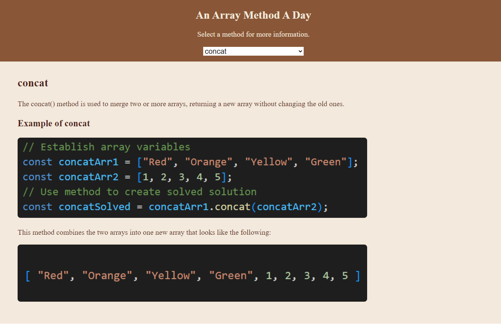
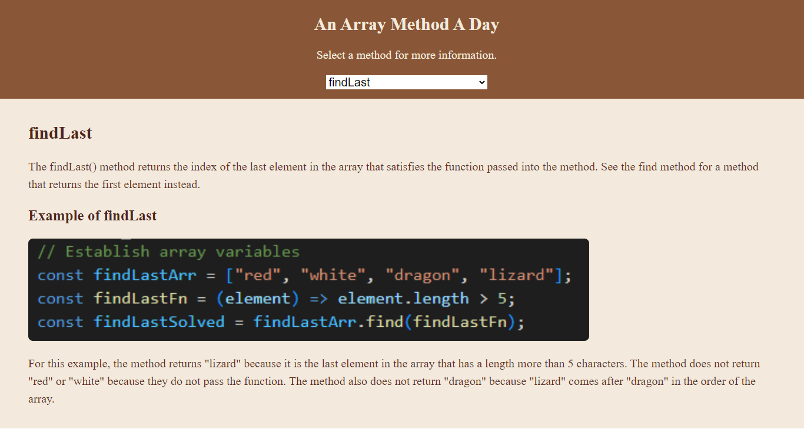

# Array Method a Day

## Description 

This application is intended to be used as a reference for array methods. It uses Javascript, HTML, and CSS. In addition, React is used as a JS library to make the application more modular.

I am currently in the process of making a live site.

## Visuals

